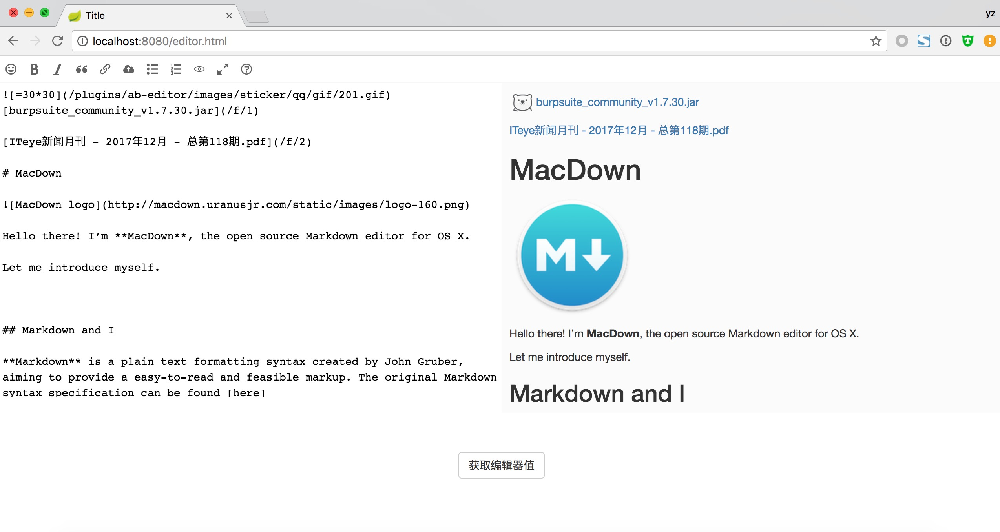
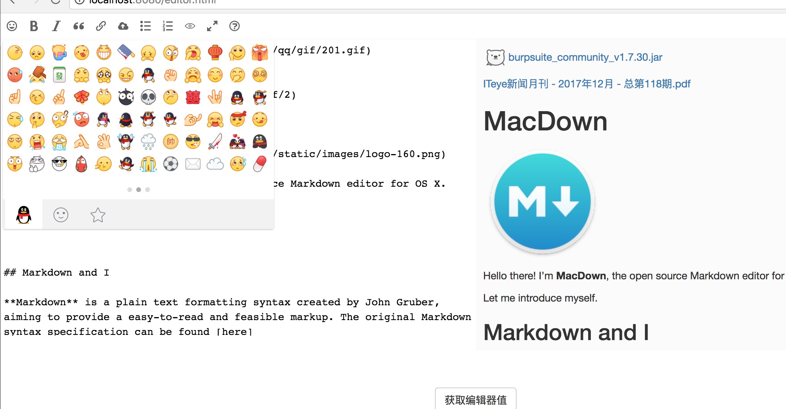

# AnBai 在线Markdown 编辑器

## 简介
这是一个简单的Markdown在线编辑器,演示项目环境是一个SpringBoot+JPA的maven项目，clone后请修改数据库密码。项目比较简单，调用请参考示例editor.html。前端代码依赖主要markdown-it.js jquery、codemirror、jquery-file-upload。


支持表情包和文件上传(表情包支持自定义表情分组、图片、描述之类的)。


## 基本配置

创建编辑器时可以指定表情包、文件上传的API地址:

```javascript
var editor = $('#ab_editor_demo').ABEditor({
    "url": "./api/ab-editor/upload_json.php",
    "emoji_api": "./api/ab-editor/emoji.php",
    "height": 400
});
```

当然也可以通过height和width指定编辑器的宽高。

获取编辑器值方式:`editor.getValue()`

HTML渲染markdown方式:

```javascript
var md = markdownit({
    html: false
});

// 获取渲染后的html代码片段
var html = md.render(content);
```

其他的配置详情见代码。

## Notice

编辑器图标用的[hacpai](https://hacpai.com/)编辑器的svg。